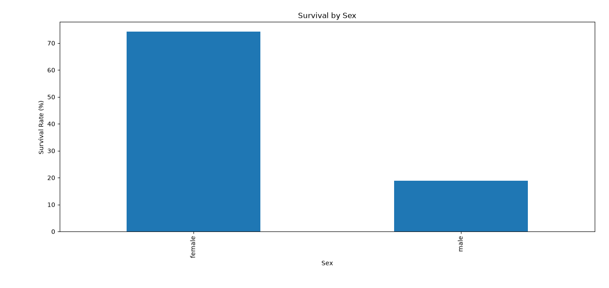
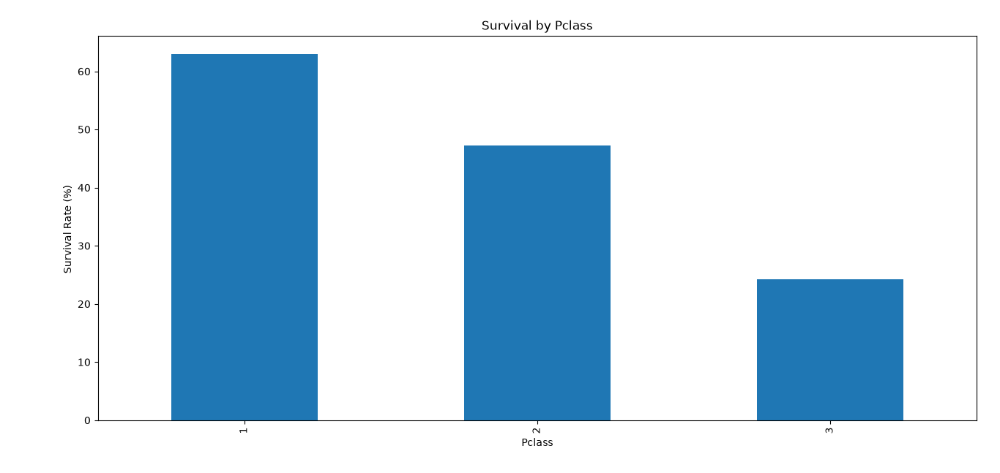
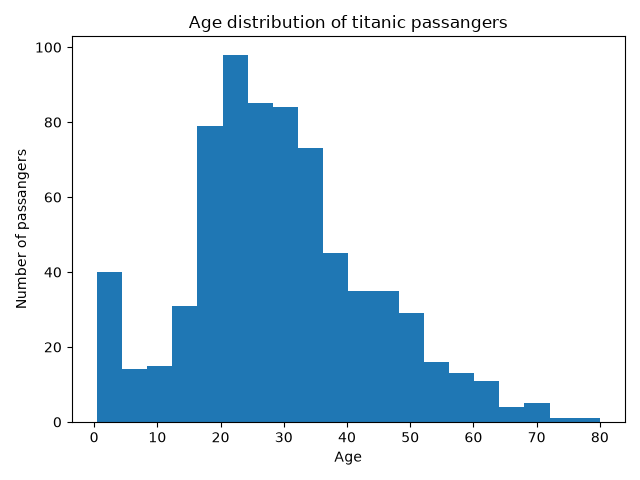
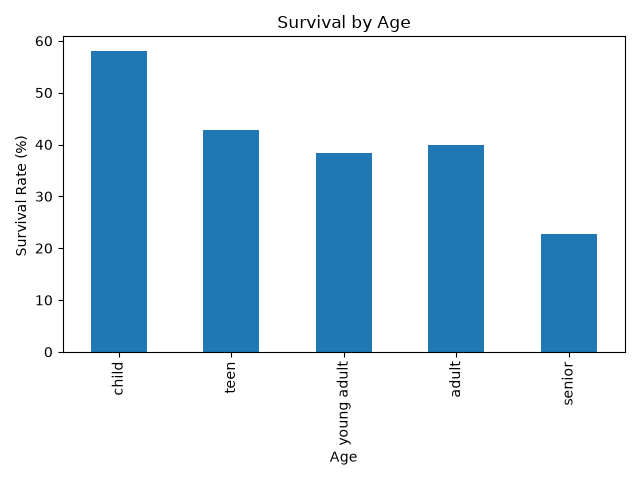
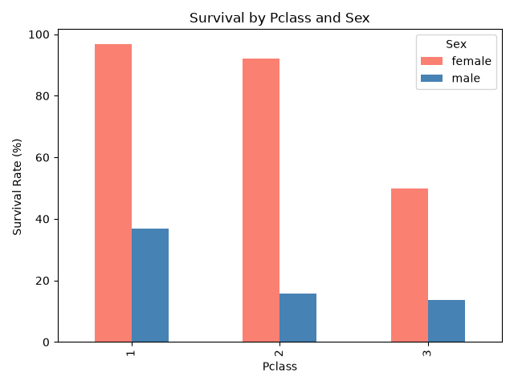
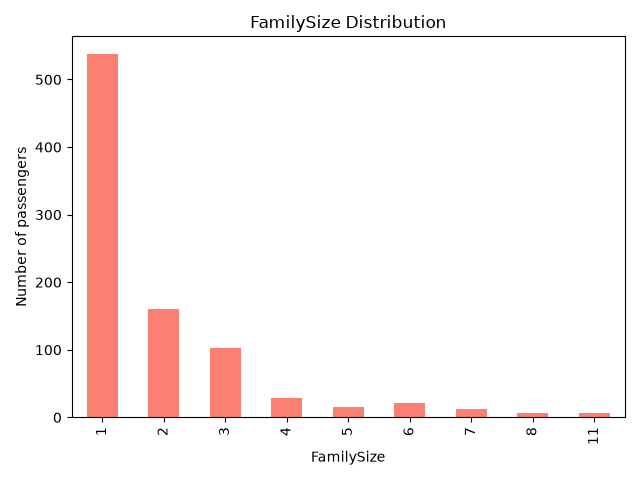
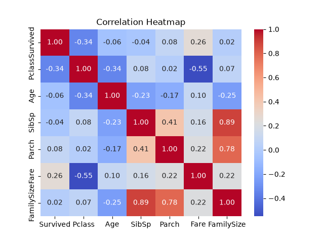

# Titanic Survival Analysis

## Project Overview
An exploratory data analysis (EDA) of the Titanic passenger dataset to identify 
factors that influenced survival rates.

## Dataset
- Source: [Kaggle Titanic Dataset](https://www.kaggle.com/c/titanic)
- 891 passengers, 12 features including age, sex, passenger class, fare, and survival status

## Key Findings
1. **Gender:** Women had a significantly higher survival rate than men (74.2% vs 18.9%)
2. **Passenger Class:** 1st class passengers survived at 63% compared to 24.2% in 3rd class
3. **Age:** Children (under 12) had the highest survival rate at ~58%
4. **Class + Gender combined:** 1st class females survived at 97% — the highest of any group
5. **Solo travellers:** 60.3% of passengers travelled alone, yet had only 30.4% survival rate
6. **Family size sweet spot:** Small-medium families (3-4 members) had the highest survival rates (57-72%),
  while very large families (8-11 members) had 0% survival

## Visualizations

### Survival Rate by Sex

### Survival Rate by Passenger Class

### Age Distribution

### Survival Rate by Age Group

### Survival Rate by Passenger Class and Sex

### Family Size Distribution

### Correlation Heatmap

## Tools Used
- Python
- pandas
- matplotlib
- seaborn
- Jupyter/PyCharm

## How to Run
1. Clone this repository
2. Install requirements: `pip install pandas matplotlib seaborn`
3. Run `titanic_analysis.py`
